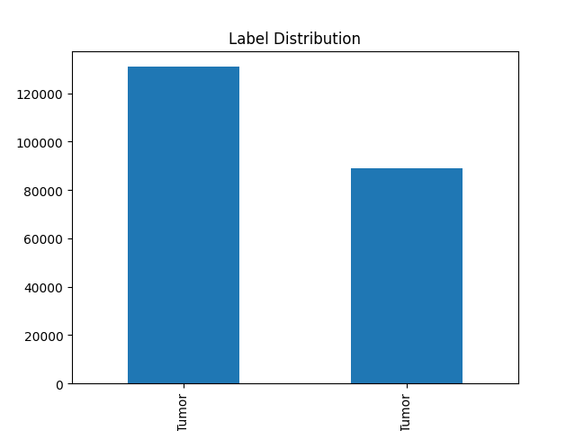

# AI_LAB5 – Histopathologic Cancer Detection

**Name:** John Gaynes  
**GitHub Repository:** [https://github.com/neoygaj/AI_LAB5](https://github.com/neoygaj/AI_LAB5)

---

## 1. Problem & Dataset Description

This project tackles a binary classification task: **detecting metastatic cancer** in small image patches of histopathologic scans of lymph node sections.

The dataset, sourced from the [PatchCamelyon (PCam)](https://github.com/basveeling/pcam) benchmark and hosted on Kaggle, is a simplified version of the Camelyon16 challenge.

- **Image Format:** 96×96 pixel RGB `.tif` images  
- **Train Set:** ~220,000 labeled images  
- **Test Set:** ~57,000 unlabeled images  
- **Label Meaning:**  
  - `1` = Tumor present in central 32×32 region  
  - `0` = No tumor  
- **Evaluation Metric:** ROC AUC (Area Under Curve)

---

## 2. Exploratory Data Analysis (EDA)

### 🔍 Class Balance Analysis  
An initial visualization of the label distribution showed a slight imbalance with more negative samples (no tumor) than positive ones.

### 🧹 Preprocessing & Cleaning Plan
- Resized all images to **96×96** pixels  
- Verified image integrity (non-empty, loadable)  
- Applied image augmentation:
  - `RandomHorizontalFlip`  
  - `RandomVerticalFlip`  
  - `RandomRotation(10)`  
  - `ColorJitter` (brightness and contrast)  
- Stratified 80/20 train-validation split

---

## 3. Model Architecture & Training Strategy

### 🧪 Model Experiments

| Model            | Description                                 | Notes                   |
|------------------|---------------------------------------------|--------------------------|
| Baseline CNN     | 2 conv layers + dense + dropout             | Very fast, decent result |
| Custom Deep CNN ✅ | 5 conv layers → 512×3×3 → FC(4608→256→1)     | **Best performing**      |
| DenseNet201      | Pretrained DenseNet with new classifier head | Underperformed slightly  |

### 🔧 Training Techniques Used
- **Loss Function:** `BCEWithLogitsLoss`  
- **Optimizer:** Adam, learning rate 0.001  
- **Early Stopping:** `patience = 5`  
- **Batch Size:** 128 (GPU-optimized)  
- **GPU:** Used `torch.device("cuda")` on **RTX 3090 (24 GB VRAM)**

---

## 4. Results & Leaderboard Performance

Final models were submitted to Kaggle and evaluated using AUC (ROC). The leaderboard score reflects both public and private test sets.

### ✅ Leaderboard Screenshots

  

### 📊 Score Summary

| Model               | Public Score | Private Score | Notes                          |
|---------------------|--------------|----------------|--------------------------------|
| Custom Deep CNN ✅   | 0.9461       | **0.9296**     | Final, best performing model   |
| DenseNet201 Transfer| 0.8835       | 0.8911         | Pretrained model               |
| CNN + Augmentation  | 0.8679       | 0.8326         | Some overfitting               |
| Baseline CNN        | 0.9210       | 0.8799         | Basic 2-layer CNN              |

---

## 5. Conclusion

This project demonstrated the full lifecycle of applied deep learning:
- Starting from a simple CNN baseline
- Scaling to deeper, custom CNNs
- Exploring transfer learning via DenseNet201
- Adding **augmentation**, **early stopping**, and **GPU acceleration**
- Optimizing batch size and epochs for performance

**Final model** achieved a **0.9296 private score**, validating its performance on unseen test data.

---

## ✅ Submission Checklist

- ✅ Report in PDF format  
- ✅ GitHub repo: [https://github.com/neoygaj/AI_LAB5](https://github.com/neoygaj/AI_LAB5)  
- ✅ Leaderboard screenshot(s)  
- ✅ All training and inference scripts in `src/`  
- ✅ README with command-line instructions  
- ✅ No raw dataset included in repo  

